# 数据科学基础-研究报告


## 小组信息


小组人数：3

| 学号      | 姓名   | 邮箱                       | Python练习完成题目数量 | 分工职责 |
| --------- | ------ | -------------------------- | ---------------------- | -------- |
| 181250010 | 陈泔錞 | 181250010@smail.nju.edu.cn | 200                    |          |
| 181250031 | 冯鑫泽 | 181250031@smail.nju.edu.cn | 200                    |          |
| 181250041 | 韩禧   | 181250041@smail.nju.edu.cn | 162                    |          |


## 目录


[小组信息](#小组信息)

[摘要](#摘要)

[1. 研究问题](#1. 研究问题)

[2. 代码开源地址](#2. 代码开源地址)

[3. 研究方法](#3. 研究方法)

​	[3.1 BGM音频分析](#3.1 BGM音频分析)

​	[3.2 短视频类型和特定热门BGM的关系分析](#3.2 短视频类型和特定热门BGM的关系分析)

[4. 案例分析](#4. 案例分析)

​	[4.1 BGM案例分析](#4.1 BGM案例分析)

​	[4.2 应用：对用户输入的视频关键词进行BGM推荐](#4.2 应用：对用户输入的视频关键词进行BGM推荐)

[5. 想对老师说的话](#5. 想对老师说的话)

[6. 附录](#6. 附录)


## 摘要

在信息化快速发展的今天，短视频逐渐成为大多数人打发空余时间的第一选择。而在越来越多的短视频平台中，抖音凭借其诸多特点与优势，已经成为4亿DUA的国民APP。其中，BGM 便是抖音平台的一大亮点，其以音乐为视频的切入点，搭配舞蹈、跑酷、表演等内容的创意表达形式，让用户轻松创作独特有张力的短视频。而抖音更是引领音乐风尚，BGM歌单风靡各大音乐平台。

本小组在此基础上，对抖音热门音乐与视频的数据进行了收集，处理和分析。针对BGM配乐，采取分“抖音组”，“对照组”两组，到各大抖音数据网站进行样本数据的收集。再通过FFmpeg，sound-similar，pyAudioAnalysis等开源软件以及Python包对配乐的节奏，旋律，特效等进行分析，探索爆款音乐的潜在特征。

同时，我们小组还收集BGM与视频的数据，进行处理与分析。运用tag标记的方法，完成视频与音乐的匹配。在视频与音乐匹配的基础上，通过对点赞等指标的分析，制定综合多维度指标的更为合理的评判标准。以此兼顾音乐对视频的帮助度与视频完成后取得的热度与关注度，为用户更精准地推荐配乐。

最后，本小组通过上述分析的结果，对未来发展进行合理预测与规划，探索了本研究更多的可以利用的商业价值的可能。

**关键字**：抖音，BGM，旋律分析，音乐推荐


## 1. 研究问题

### 1.1 研究背景

在信息化快速发展的今天，短视频逐渐成为大多数人打发空余时间的第一选择。而在越来越多的短视频平台中，抖音凭借其诸多特点与优势，已经成为4亿DUA的国民APP。其中，BGM 便是抖音平台的一大亮点，其以音乐为视频的切入点，搭配舞蹈、跑酷、表演等内容的创意表达形式，让用户轻松创作独特有张力的短视频。而抖音更是引领音乐风尚，BGM歌单风靡各大音乐平台。通过使用经验我们可以发现部分BGM通过它自身的旋律，节奏，音效上的优势，获得较高的热度与关注度。同时，抖音BGM种类繁多，曲目量大。视频创作者无法第一时间寻找到最适合自己的BGM 。

### 1.2 研究问题

基于以上背景，我们从BGM与视频角度出发。

首先从BGM本身开始研究。分析不同BGM的旋律，节奏与用到的特效。在对处理得到的数据进行分析，得出成为爆款的音乐的普遍特性，研究什么样的音乐更为视频创作者与软件使用者所欢迎，同时对未来的音乐发展轨迹与大众喜好进行合理预测。

之后，我们在此基础上，寻找视频与BGM的深度联系。通过对数据的处理分析，在音乐与内容匹配的基础上，兼顾热度与音乐本身对于视频的帮助度为用户推荐最适合自己的BGM。

最后对于以上研究的结果，探索更多商业价值与商业合作。


## 2. 代码开源地址

1. https://github.com/UKULELER/BGM

   该地址为我们项目分析及成果代码的开源地址

   

2. 


## 3. 研究方法

### 3.1 BGM音频分析

#### 3.1.1 概述

##### 通过对音频本身特点提取、不同音频进行比对，结合音乐对心理因素的影响，分析抖音热门BGM的基本特征，并进行猜想：

1. BGM的旋律具有稳定性
2. BGM偏向于快节奏，一般对应整首歌中的高光部分
3. BGM会对原曲进行一些改变，可能加入特殊的音效
4. 对应不同题材的短视频，会有特定的BGM适用

##### 分析采用了开源软件及python语言，涉及多个音频处理工具，包括：

1. 开源计算机程序FFmpeg，用于记录、转换数字音频、视频，并能将其转化为流。


一些音频数据初始为mp3格式，通过这一开源程序转为WAV，便于使用python进行特征提取。

1. 音频对比软件sound-similar


可以对两个WAV格式的音频进行比对，得到一个音频相似度的分析结果。

1. pyAudioAnalysis

这是一个用于音频分析的python包，具有丰富的功能和强大的处理能力

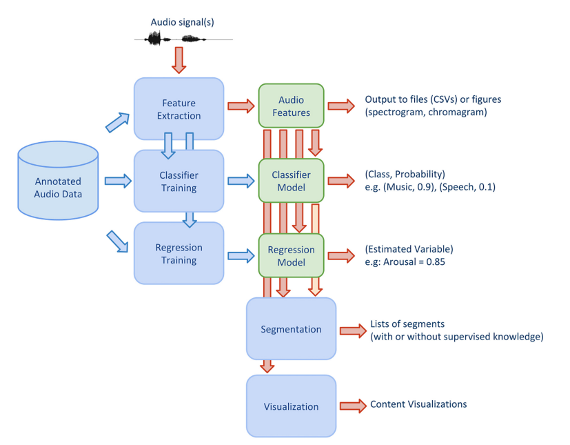

与之关联的还有pydub、numpy、hmmlearn等依赖包。

通过这个python包，可以计算Zero Crossing Rate、Entropy of Energy、MFCCs等常见数值，最终以json的形式保存。

##### 除了工具外，还用到一些APP及数据网站：

1. 抖音


我们所作的数据分析全部基于抖音短视频，聚焦于对BGM及其外延的研究。

1. 卡思数据


国内较大的视频数据分析平台，拥有大量MCN数据统计及良好的可视化展示。热门BGM的数据就参考了该平台数据。

1. 飞瓜数据


一家较大的数据分析网站，主要面向抖音数据，更加重视视频数据，提供的BGM往往与高赞视频相结合。

1. TooBigData


这一平台数据丰富，最大的特点是大部分的数据都可以免费查看，适合非机构用户使用。

1. 蝉妈妈数据


这一平台对BGM数据有较好的可视化分析，适合用于研究外延性猜想：


#### 3.1.2 研究背景

短视频内容产品的崛起有其时代原因，也与移动智能设备及基建的完善等有关。在研究BGM之前，我先去了解了一下抖音、快手这类产品取得成果的原因：

```word
1.时机

抖音于2016年9月上线，当时短视频正处于高热度阶段，在移动化、碎片化消费日益盛行的当下，低门槛低成本地分享生活信息的短视频成了最应景的消费产品。

2.内容社区

抖音的内容社区保证了UGC的可持续性。具体来说就是：一方面，抖音通过签约一批网红、MCN来保证优质内容的持续产出，且成立了服务达人的经纪团队，通过广告等变现手段进行激励；另一方面，使用与今日头条一脉相承的算法分发机制，持续挖掘普通用户的爆款内容，“中心化”进行内容分发，保障优质内容的传播优先性，个性化推荐机制投其所好，精准抓取用户痒点，维持用户活跃度。

3.用户粘度

抖音很好地消解了用户无聊的时光，交互简单，即时满足，永无止境；通过下滑即可源源不断获取新内容，全屏沉浸式体验，用户的兴奋点不断被刺激，甚至难以自拔。抖音有的不仅仅是“音乐+短视频+社交”的新鲜感，真正解决的痛点是让普通年轻用户获得感官的刺激与价值观的认同，填补孤独；让拍摄者满足于炫耀，并实现变现。

4.盈利模式

盈利模式清晰有效，包括广告、直播等增值服务，生命力得到支撑和保障，如此才不会昙花一现就没落。

                                                                                                                                                                                                        --by 穆宁
```

采用几十秒的视频来为用户提供高频刺激，就需要具备丰富的内容要素，BGM是其中不可或缺的一环。好的BGM对于用户的情绪调动、快感获取、连接叙事、氛围营造等都有不可或缺的作用。

抖音的定位为音乐短视频，内容品类丰富多样，但在我们经过**50+小时**的使用后发现，常用BGM的数量很小，在形成信息茧房后约为20~30左右，且特定类型的短视频总是搭配固定的BGM。由于平台的判定方式，不同人剪辑的音乐片段会算作不同BGM（即使内容完全一样），所以对于热门的BGM单曲，原歌曲实际被使用可能远超过这个数量。

在实际的数据分析中，我们采用了手动的方式，结合各数据平台的信息，选择了**15首热门BGM**，将其中十首用作分析，五首作为检验案例，寻找其相同点，并下载了**对应的整首歌曲**进行对照分析，从整体的角度去看待BGM部分。由于短视频MCN竞争激烈，BGM中良币驱逐劣币的现象严重，再加上抖音官方的强运营政策，很难去找到所谓“不热门”或“不好”的BGM，另一方面，BGM是用来与内容进行搭配的，那么暂时没有出现在抖音BGM中的歌曲，可能是因为还没有出现适合它们的题材（参照抖音内容发展的过程而言）。

在对抖音中音乐进行了解的过程中，发现BGM往往是随作品搭配的，这也符合创作路径中的先拍摄后配音的过程。于是，我们也对抖音的内容分布进行了统计分析。

此外，虽然各BGM的数据存在差别，但考虑到不同BGM对应于不同题材的作品，而各赛道作品数量则天然地存在差异，故没有依据数据不同对BGM进行对比分析。

在研究过程中，遇到了数据采集的诸多困难，最终未能得到大量数据进行研究，而是将目光放在数据优秀的个别作品进行小范围分析，并通过运用各数据平台已有的统计结果去验证猜想。

#### 3.1.3 数据采集

##### 3.1.3.1 数据筛选

**遵循规则：**

1. 有较高播放量的BGM，播放量在100w+
2. 有较高增速，这点要求是结合了数据平台统计的排名规则，方便找到符合要求的BGM
3. BGM种类尽可能多样化，由人工进行鉴别
4. 出现了至少一个超过百万赞的爆款视频
5. 该音频对应的UGC内容中，有超过10个不同作者的BGM，即一首歌曲被多个人做成了内容相近的BGM

**最终得到的数据为：**

| 序号 | 歌曲                    |
| ---- | ----------------------- |
| 1    | 旧梦一场                |
| 2    | 怎么开心怎么活          |
| 3    | 小星星                  |
| 4    | 谪仙                    |
| 5    | dance monkey            |
| 6    | 你的答案                |
| 7    | dancing with your ghost |
| 8    | 桥边姑娘                |
| 9    | 我和你                  |
| 10   | 一起长大的幸福          |
| 11   | warp me in plastic      |
| 12   | 你笑起来真好看          |
| 13   | 陪你长大                |
| 14   | 蓝色海黑色河            |
| 15   | 带你去旅行              |

##### 

##### 3.1.3.2 设计分析方法

###### 3.1.3.2.1 基本采集

通过praat进行最初的解析，得到音频数据的基本信息，包括pitch analyse、formant analyse、intensity analyse、curve等部分内容的分析。

###### 3.1.3.2.2 精细采集

由于BGM普遍为15s左右，属于短音频，故通过pyAudioAnalysis进行音频的数据分析，获取一些**短期特征**。以下为部分特征的介绍：

##### 1. 过零率

过零率体现的是信号过零点的次数，体现的是频率特性。这个特征在语音对比、语音识别和 music information retrieval 领域得到广泛使用，是对敲击声音的进行分类的主要特征。

以下为过零率的数学表达式：

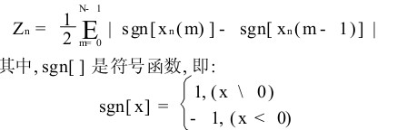

##### 2. 短时能量

短时能量体现的是信号在不同时刻的强弱程度，通过每一帧语音信号的平方和表示。

以下为短时能量的数学表达式：


##### 3. 短时功率谱密度

功率谱定义为单位频带内的信号功率。它表示了信号功率随着频率的变化情况，即信号功率在频域的分布状况。

将音频信号视作周期性变换，时域与频域之间利用傅里叶变换进行关联。

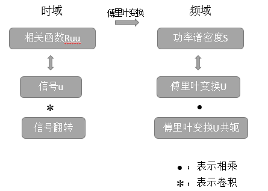

功率谱之所以可以估计，是基于两点假设：1）信号平稳; 2)随机信号具有遍历性

以下为功率谱的数学表达式：

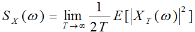

##### 4. 谱熵

谱熵（spectral entropy ）这一概念描述了功率谱和熵率之间的关系。分布越均匀，熵越大，反应了每一帧信号的均匀程度，如说话人频谱由于共振峰存在显得不均匀，而白噪声的频谱就更加均匀，借此进行VAD便是应用之一。

以下为谱熵的数学表达式：


其中，p（i）代表每一帧信号的频谱绝对值归一化的结果：

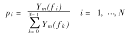

##### 5. 短时自相关函数

信号处理中，自相关可以提供关于重复事件的信息，例如音乐节拍（例如，确定节奏）或脉冲星的频率（虽然它不能告诉我们节拍的位置）。另外，它也可以用来估计乐音的音高。

以下为自相关函数的数学表达式：

定义变量 X 和 Y 的相关系数：

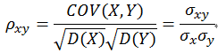

相关系数越大，相关性越大，但肯定小于或者等于1。

自相关函数是描述随机信号 x(t) 在任意不同时刻 t1,t2的取值之间的相关程度，定义为：

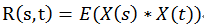

##### 6. 梅尔频率倒谱系数

梅尔倒谱系数（Mel-scale Frequency Cepstral Coefficients，简称MFCC）是在Mel标度频率域提取出来的倒谱参数，Mel标度描述了人耳频率的非线性特性，它与频率的关系可用下式近似表示：

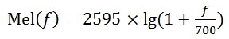

对连续语音使用梅尔倒谱进行分析，主要流程为：预加重、分帧、加窗、傅里叶变换、三角带通滤波器、计算每个滤波器组输出的对数能量、离散余弦变换。

##### 7. 标准差

标准差（Standard Deviation） ，是离均差平方的算术平均数的算术平方根，在概率统计中最常使用作为统计分布程度上的测量依据。标准差能反映一个数据集的离散程度。


#### 3.1.3 数据分析

由于音频解析、音频之间的比对本身具有一定的难度，且BGM中往往有多种声音交杂导致音频数据纷杂，我们很难通过某种绝对正确的算法来得出各个音频中的共性和差异性。即便数据上存在，也难以保证是有效的结论而非巧合。

短视频受到 “人” 本身感知的影响较大，所以除了对基本的解析数据做出统计分析、假设检验等工作，我们增加了 “人” 在数据分析中的工作量，从而有效解决了音频难以与短视频内容、风格、心理影响等复杂因素进行联系的问题，避免了结论的片面性，但同时也增加了主观性。

通过对获得的BGM及其音频解析数据进行分析，得出各自比较显著的特征，再从中找到具有一定普遍性的特点作为印证猜想的论据。

*注：1.收集音频大多为双声道，故波形图由上下两部分组成。*

 *2.BGM与创作部分的内容，视频数据统计结果来自[蝉妈妈](https://www.chanmama.com/)*

##### 旧梦一场

以下为波形图：

 *旧梦一场*

以下为基本音频信息：

```python
Time domain:
   Start time: 0 seconds
   End time: 17.357256235827663 seconds
   Total duration: 17.357256235827663 seconds
Time sampling:
   Number of frames: 1732 (1026 voiced)
   Time step: 0.01 seconds
   First frame centred at: 0.02362811791383301 seconds
Ceiling at: 600 Hz

Estimated quantiles:
   10% = 92.4347172 Hz = 85.4408092 Mel = -1.36191943 semitones above 100 Hz = 2.81002867 ERB
   16% = 92.8363898 Hz = 85.784581 Mel = -1.28685209 semitones above 100 Hz = 2.82081316 ERB
   50% = 158.354333 Hz = 139.164388 Mel = 7.9578761 semitones above 100 Hz = 4.4469203 ERB
   84% = 376.189159 Hz = 286.638116 Mel = 22.9374993 semitones above 100 Hz = 8.53518075 ERB
   90% = 429.044803 Hz = 317.16252 Mel = 25.2135397 semitones above 100 Hz = 9.32258682 ERB
Estimated spreading:
   84%-median = 217.9 Hz = 147.5 Mel = 14.99 semitones = 4.09 ERB
   median-16% = 65.55 Hz = 53.41 Mel = 9.249 semitones = 1.627 ERB
   90%-10% = 336.8 Hz = 231.8 Mel = 26.59 semitones = 6.516 ERB

Minimum 74.9860699 Hz = 70.2960957 Mel = -4.98366579 semitones above 100 Hz = 2.3306148 ERB
Maximum 597.492937 Hz = 404.47908 Mel = 30.9470599 semitones above 100 Hz = 11.4866515 ERB
Range 522.5 Hz = 334.182984 Mel = 35.93 semitones = 9.156 ERB
Average: 227.929697 Hz = 182.175284 Mel = 10.9293096 semitones above 100 Hz = 5.58054673 ERB
Standard deviation: 141.3 Hz = 95.42 Mel = 10.79 semitones = 2.667 ERB

Mean absolute slope: 1023 Hz/s = 691.9 Mel/s = 79.94 semitones/s = 19.37 ERB/s
Mean absolute slope without octave jumps: 28.14 semitones/s
```

结合波形图及数据，我们可以对这一音频进行简单的分析，并提取出这首BGM的一些基本特性：

- 高低音区分明显，在原音乐中体现为歌声与穿插的鼓点交替出现
- 音频解析后数据中的标准差较大（95.42 Mel），且音频有着大的变化范围（334.18 Mel），这也与上条的特性相照应，说明BGM的声音区分度明显，高低变化较为剧烈

此外，结合内容创作的情况，可以得到结论：

- 这个BGM一般对应照片集性质的内容，即与视觉向作品结合，作为声音上的补充。每次鼓点之间可以进行照片切换。

##### 怎么开心怎么活

以下为波形图：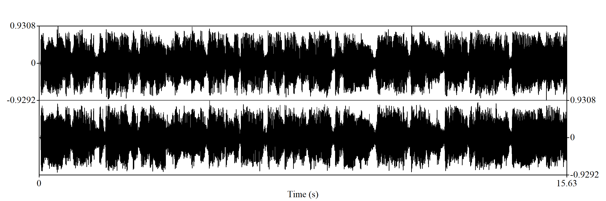

​		*怎么开心怎么活*

以下为基本音频信息：

```python
Time domain:
   Start time: 0 seconds
   End time: 15.633174603174604 seconds
   Total duration: 15.633174603174604 seconds
Time sampling:
   Number of frames: 1560 (424 voiced)
   Time step: 0.01 seconds
   First frame centred at: 0.02158730158730215 seconds
Ceiling at: 600 Hz

Estimated quantiles:
   10% = 81.1366077 Hz = 75.6822301 Mel = -3.61890132 semitones above 100 Hz = 2.50209327 ERB
   16% = 85.3483703 Hz = 79.3403517 Mel = -2.74277387 semitones above 100 Hz = 2.61793691 ERB
   50% = 130.517138 Hz = 117.114101 Mel = 4.61087115 semitones above 100 Hz = 3.78644575 ERB
   84% = 270.809957 Hz = 220.20533 Mel = 17.2473694 semitones above 100 Hz = 6.7571523 ERB
   90% = 300.133789 Hz = 239.511502 Mel = 19.027269 semitones above 100 Hz = 7.2835975 ERB
Estimated spreading:
   84%-median = 140.5 Hz = 103.2 Mel = 12.65 semitones = 2.974 ERB
   median-16% = 45.22 Hz = 37.82 Mel = 7.362 semitones = 1.17 ERB
   90%-10% = 219.3 Hz = 164 Mel = 22.67 semitones = 4.787 ERB

Minimum 74.9923816 Hz = 70.3016501 Mel = -4.98220863 semitones above 100 Hz = 2.3307922 ERB
Maximum 587.26647 Hz = 399.555503 Mel = 30.6481832 semitones above 100 Hz = 11.3678225 ERB
Range 512.3 Hz = 329.253852 Mel = 35.63 semitones = 9.037 ERB
Average: 173.75544 Hz = 145.268154 Mel = 6.75468618 semitones above 100 Hz = 4.54772288 ERB
Standard deviation: 111.5 Hz = 77.08 Mel = 9.426 semitones = 2.182 ERB

Mean absolute slope: 407.1 Hz/s = 288.7 Mel/s = 37.23 semitones/s = 8.261 ERB/s
Mean absolute slope without octave jumps: 10.89 semitones/s
```

结合波形图及数据，我们可以对这一音频进行简单的分析，并提取出这首BGM的一些基本特性：

- 高低音之间的差别偏小，即原声的情况较为平稳
- 波形图中出现了明显而连续的峰和谷，说明原歌曲中有明晰的声音变化（对应地，BGM中的歌词之间字字分明）
- 歌曲中存在一个持续而稳定的底音（暂不清楚为什么作者加入这一混响音），使得分析数据得出的平均绝对斜率较低，即数值上看，这段BGM呈现出更为稳定的特征

此外，结合内容创作的情况，可以得到结论：

- 这首歌曲与乡土生活结合较多，对应的短视频内容大多为此题材，具有一定的特殊性。但在与乡土有关的音乐中，可能是由于其节奏的舒缓和稳定，随之带来的情感带动、氛围营造、魔性洗脑等效果，使得它成为了最受欢迎的BGM之一。

##### 小星星

以下为波形图：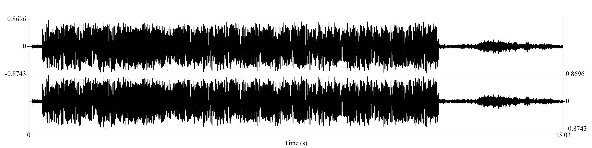

​		*小星星*

以下为基本音频信息：

```python
Time domain:
   Start time: 0 seconds
   End time: 15.032358276643992 seconds
   Total duration: 15.032358276643992 seconds
Time sampling:
   Number of frames: 1500 (845 voiced)
   Time step: 0.01 seconds
   First frame centred at: 0.0211791383219958 seconds
Ceiling at: 600 Hz

Estimated quantiles:
   10% = 80.5280807 Hz = 75.1516774 Mel = -3.74923375 semitones above 100 Hz = 2.48525058 ERB
   16% = 83.4875256 Hz = 77.7271165 Mel = -3.12440933 semitones above 100 Hz = 2.566911 ERB
   50% = 104.351147 Hz = 95.5492185 Mel = 0.737357567 semitones above 100 Hz = 3.12538385 ERB
   84% = 305.815585 Hz = 243.17515 Mel = 19.3519432 semitones above 100 Hz = 7.38256282 ERB
   90% = 360.075804 Hz = 276.985291 Mel = 22.1796079 semitones above 100 Hz = 8.28249508 ERB
Estimated spreading:
   84%-median = 201.6 Hz = 147.7 Mel = 18.63 semitones = 4.26 ERB
   median-16% = 20.88 Hz = 17.83 Mel = 3.864 semitones = 0.5588 ERB
   90%-10% = 279.7 Hz = 202 Mel = 25.94 semitones = 5.801 ERB

Minimum 75.0794561 Hz = 70.3782713 Mel = -4.96211874 semitones above 100 Hz = 2.33323928 ERB
Maximum 596.418356 Hz = 403.963786 Mel = 30.9158959 semitones above 100 Hz = 11.4742319 ERB
Range 521.3 Hz = 333.585514 Mel = 35.88 semitones = 9.141 ERB
Average: 159.103226 Hz = 133.734 Mel = 4.96387125 semitones above 100 Hz = 4.2024469 ERB
Standard deviation: 113.2 Hz = 78.4 Mel = 9.476 semitones = 2.218 ERB

Mean absolute slope: 1013 Hz/s = 704.1 Mel/s = 89.76 semitones/s = 20.01 ERB/s
Mean absolute slope without octave jumps: 31.76 semitones/s
```

结合波形图及数据，我们可以对这一音频进行简单的分析，并提取出这首BGM的一些基本特性：

- 这首BGM的波形图非常稳定，虽然有频繁的峰谷变化，但从整体来看，声音的效果没有出现大的变化
- 抛却首尾的杂音后，可以直观地从波形图中看到，这首BGM中加入了大量的混响，甚至对歌声造成了一定的掩盖，波形密集而混杂，具有丰富的鼓点、打碟声等
- 从数据分析的结果看，音频的平均绝对斜率较高（31.76），变化范围也较大（333.59 Mel），但标准差却是较小的（78.4 Mel），这个数据结果刚好和我们对BGM波形图及歌声的判断相符

此外，结合内容创作的情况，可以得到结论：

##### 谪仙

以下为波形图：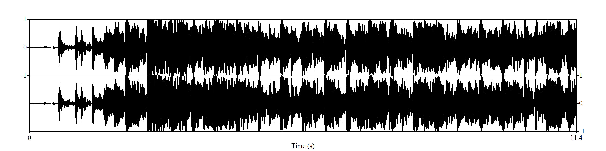

​		*谪仙*

以下为基本音频信息：

```python
Time domain:
   Start time: 0 seconds
   End time: 11.427460317460318 seconds
   Total duration: 11.427460317460318 seconds
Time sampling:
   Number of frames: 1139 (552 voiced)
   Time step: 0.01 seconds
   First frame centred at: 0.023730158730158487 seconds
Ceiling at: 600 Hz

Estimated quantiles:
   10% = 110.515949 Hz = 100.706646 Mel = 1.73105505 semitones above 100 Hz = 3.28490589 ERB
   16% = 145.374266 Hz = 128.992564 Mel = 6.47726292 semitones above 100 Hz = 4.14411116 ERB
   50% = 194.728 Hz = 166.705425 Mel = 11.5375241 semitones above 100 Hz = 5.2516041 ERB
   84% = 393.67151 Hz = 296.922918 Mel = 23.7239077 semitones above 100 Hz = 8.80243013 ERB
   90% = 437.25874 Hz = 321.757631 Mel = 25.5418467 semitones above 100 Hz = 9.43964607 ERB
Estimated spreading:
   84%-median = 199.1 Hz = 130.3 Mel = 12.2 semitones = 3.554 ERB
   median-16% = 49.4 Hz = 37.75 Mel = 5.065 semitones = 1.108 ERB
   90%-10% = 327 Hz = 221.3 Mel = 23.83 semitones = 6.16 ERB

Minimum 76.6116733 Hz = 71.7248014 Mel = -4.61236635 semitones above 100 Hz = 2.37620751 ERB
Maximum 597.606775 Hz = 404.53364 Mel = 30.950358 semitones above 100 Hz = 11.4879663 ERB
Range 521 Hz = 332.808839 Mel = 35.56 semitones = 9.112 ERB
Average: 254.314749 Hz = 201.767034 Mel = 13.7510764 semitones above 100 Hz = 6.15400509 ERB
Standard deviation: 134.7 Hz = 88.32 Mel = 9.216 semitones = 2.432 ERB

Mean absolute slope: 518.5 Hz/s = 350.8 Mel/s = 38.58 semitones/s = 9.789 ERB/s
Mean absolute slope without octave jumps: 15.6 semitones/s
```

结合波形图及数据，我们可以对这一音频进行简单的分析，并提取出这首BGM的一些基本特性：

- 除去开头时的不稳定音频后，可以看到波形图中出现了明显的音频波动情况，即歌词播放较为清晰，与背景音乐有着明显的差别。同其他BGM类似，这首曲子也有着鼓点等混响。
- 从数据中看，这首BGM的数据同其他BGM相比，处于一个较为平均的水平。稍高的标准差（88.32 Mel）也印证了波形图中音频波动的解释。

此外，结合内容创作的情况，可以得到结论：

- 这首曲子能够从音乐中带来侠客般的氛围，其实音调也偏高，多用于混剪类作品。

##### dance monkey

以下为波形图：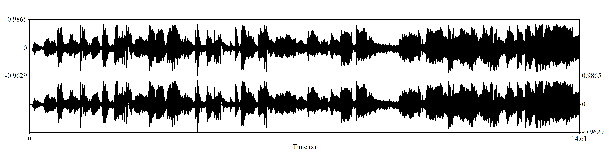

以下为基本音频信息：

```python
Time domain:
   Start time: 0 seconds
   End time: 14.61439909297052 seconds
   Total duration: 14.61439909297052 seconds
Time sampling:
   Number of frames: 1458 (1052 voiced)
   Time step: 0.01 seconds
   First frame centred at: 0.02219954648526123 seconds
Ceiling at: 600 Hz

Estimated quantiles:
   10% = 83.6081105 Hz = 77.8317996 Mel = -3.09942235 semitones above 100 Hz = 2.570225 ERB
   16% = 92.3384496 Hz = 85.3583866 Mel = -1.37995903 semitones above 100 Hz = 2.80744235 ERB
   50% = 364.618395 Hz = 279.723755 Mel = 22.3966482 semitones above 100 Hz = 8.35436642 ERB
   84% = 437.12956 Hz = 321.685661 Mel = 25.5367313 semitones above 100 Hz = 9.43781553 ERB
   90% = 491.86485 Hz = 351.367078 Mel = 27.5791435 semitones above 100 Hz = 10.1851444 ERB
Estimated spreading:
   84%-median = 72.55 Hz = 41.98 Mel = 3.142 semitones = 1.084 ERB
   median-16% = 272.4 Hz = 194.5 Mel = 23.79 semitones = 5.55 ERB
   90%-10% = 408.5 Hz = 273.7 Mel = 30.69 semitones = 7.619 ERB

Minimum 75.0395858 Hz = 70.3431888 Mel = -4.97131475 semitones above 100 Hz = 2.33211886 ERB
Maximum 589.114833 Hz = 400.448675 Mel = 30.7025865 semitones above 100 Hz = 11.3894057 ERB
Range 514.1 Hz = 330.105486 Mel = 35.67 semitones = 9.057 ERB
Average: 287.890266 Hz = 221.508251 Mel = 14.8263376 semitones above 100 Hz = 6.65895461 ERB
Standard deviation: 157.5 Hz = 105.9 Mel = 11.82 semitones = 2.951 ERB

Mean absolute slope: 887.8 Hz/s = 609.9 Mel/s = 71.72 semitones/s = 17.16 ERB/s
Mean absolute slope without octave jumps: 19.07 semitones/s
```

结合波形图及数据，我们可以对这一音频进行简单的分析，并提取出这首BGM的一些基本特性：

- 从波形图中，非常明显可以看出，这首BGM非常地不稳定，从原声中也可以听到，存在频繁的变调与混音。
- 从数据分析来看，高达 105.9 Mel 的标准差也说明了变化幅度的剧烈。

此外，结合内容创作的情况，可以得到结论：

- 这首BGM的使用数据较其他BGM会有一点偏底，作为英文歌，使用者常来搭配一些外国元素的内容或**鬼畜**内容，很难不去猜测，后一个题材与频繁变调的BGM节奏有着较强关联。

##### 你的答案

以下为波形图：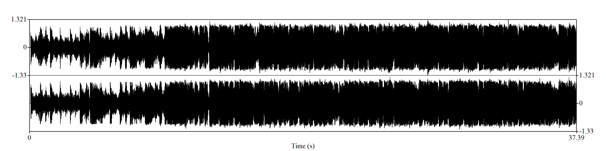

以下为基本音频信息：

```python
Time domain:
   Start time: 0 seconds
   End time: 37.3931746031746 seconds
   Total duration: 37.3931746031746 seconds
Time sampling:
   Number of frames: 3736 (1898 voiced)
   Time step: 0.01 seconds
   First frame centred at: 0.021587301587303927 seconds
Ceiling at: 600 Hz

Estimated quantiles:
   10% = 77.6131936 Hz = 72.6031706 Mel = -4.3875141 semitones above 100 Hz = 2.40419945 ERB
   16% = 77.8333743 Hz = 72.796089 Mel = -4.3384703 semitones above 100 Hz = 2.41034348 ERB
   50% = 104.2197 Hz = 95.438722 Mel = 0.71553603 semitones above 100 Hz = 3.12195609 ERB
   84% = 237.264885 Hz = 197.255569 Mel = 14.9579832 semitones above 100 Hz = 6.12008108 ERB
   90% = 288.639113 Hz = 232.024208 Mel = 18.3512017 semitones above 100 Hz = 7.0804267 ERB
Estimated spreading:
   84%-median = 133.1 Hz = 101.8 Mel = 14.25 semitones = 2.999 ERB
   median-16% = 26.39 Hz = 22.65 Mel = 5.055 semitones = 0.7118 ERB
   90%-10% = 211.1 Hz = 159.5 Mel = 22.74 semitones = 4.677 ERB

Minimum 74.987393 Hz = 70.29726 Mel = -4.98336033 semitones above 100 Hz = 2.33065198 ERB
Maximum 568.939487 Hz = 390.620093 Mel = 30.0993026 semitones above 100 Hz = 11.1512437 ERB
Range 494 Hz = 320.322833 Mel = 35.08 semitones = 8.821 ERB
Average: 134.434436 Hz = 116.957118 Mel = 2.88795032 semitones above 100 Hz = 3.73061249 ERB
Standard deviation: 79.23 Hz = 58.84 Mel = 8.188 semitones = 1.715 ERB

Mean absolute slope: 225 Hz/s = 169.9 Mel/s = 25.47 semitones/s = 5.003 ERB/s
Mean absolute slope without octave jumps: 10.88 semitones/s
```

结合波形图及数据，我们可以对这一音频进行简单的分析，并提取出这首BGM的一些基本特性：

- 波形图与《小星星》有一些类似，但明显地，起伏更小，曲调、音量都非常稳定。
- 从数据中低至 58.84 Mel 的标准差就可以证明对波形图的分析。此外，可以看到分位数计算中，从50%部分一直到90%部分都保持着较低的数值（95.44 Mel ~ 232.02 Mel）。听过歌曲就会发现，这其实是是一首舒缓轻松的音乐。

此外，结合内容创作的情况，可以得到结论：

- 题材多为励志、成长等内容，贴近生活，富有人情味，与数据分析及音乐本身特点是相符的。

##### dancing with your ghost

以下为波形图：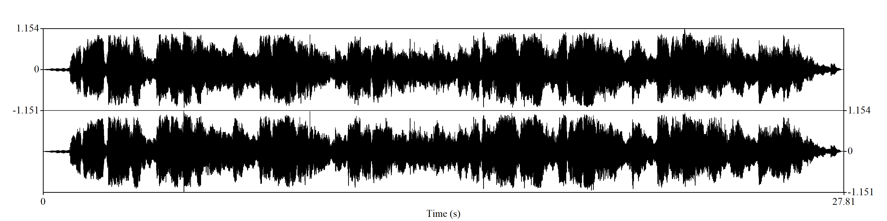

以下为基本音频信息：

```python
Time domain:
   Start time: 0 seconds
   End time: 27.8062358276644 seconds
   Total duration: 27.8062358276644 seconds
Time sampling:
   Number of frames: 2777 (2113 voiced)
   Time step: 0.01 seconds
   First frame centred at: 0.023117913832199407 seconds
Ceiling at: 600 Hz

Estimated quantiles:
   10% = 82.4245479 Hz = 76.8034539 Mel = -3.34624832 semitones above 100 Hz = 2.53765251 ERB
   16% = 90.0119205 Hz = 83.3626881 Mel = -1.82174425 semitones above 100 Hz = 2.74474483 ERB
   50% = 156.068175 Hz = 137.386436 Mel = 7.70611657 semitones above 100 Hz = 4.39421724 ERB
   84% = 232.267 Hz = 193.75281 Mel = 14.5894103 semitones above 100 Hz = 6.0217205 ERB
   90% = 242.21737 Hz = 200.704643 Mel = 15.3156279 semitones above 100 Hz = 6.21663702 ERB
Estimated spreading:
   84%-median = 76.22 Hz = 56.38 Mel = 6.885 semitones = 1.628 ERB
   median-16% = 66.07 Hz = 54.04 Mel = 9.53 semitones = 1.65 ERB
   90%-10% = 159.8 Hz = 123.9 Mel = 18.67 semitones = 3.68 ERB

Minimum 75.4434988 Hz = 70.6984949 Mel = -4.87837813 semitones above 100 Hz = 2.34346398 ERB
Maximum 392.563948 Hz = 296.277018 Mel = 23.6751322 semitones above 100 Hz = 8.78570564 ERB
Range 317.1 Hz = 225.578524 Mel = 28.55 semitones = 6.442 ERB
Average: 162.13448 Hz = 139.736155 Mel = 6.89454579 semitones above 100 Hz = 4.42670564 ERB
Standard deviation: 67.11 Hz = 50.5 Mel = 7.196 semitones = 1.481 ERB

Mean absolute slope: 360.9 Hz/s = 274.8 Mel/s = 39.98 semitones/s = 8.096 ERB/s
Mean absolute slope without octave jumps: 23.26 semitones/s
```

结合波形图及数据，我们可以对这一音频进行简单的分析，并提取出这首BGM的一些基本特性：

- 这首BGM有着较大的波动与变化，但相比《dance monkey》更加稳定，在波形图中，虽然整体上有过多次变化，但在变化后的一段时间里，波形是保持稳定状态的。频率较低的部分对应的是没有歌词的部分，可以看出BGM的背景音乐较低。
- 从数据的角度看，这首曲子的频率变化范围较小（225.58 Mel），这是由于最高频率较低（392.56 Mel）。在听觉感受来看，与其舒缓、温和的叙事感曲调是相符的。

此外，结合内容创作的情况，可以得到结论：

- 这首BGM往往搭配叙事、抒情、感人或场面较为平静的内容（有室内运动的高赞作品）。其温和而略带伤感的曲风，以及较小的频率变化，能够很好地带入氛围，营造叙事感。

##### 桥边姑娘

以下为波形图：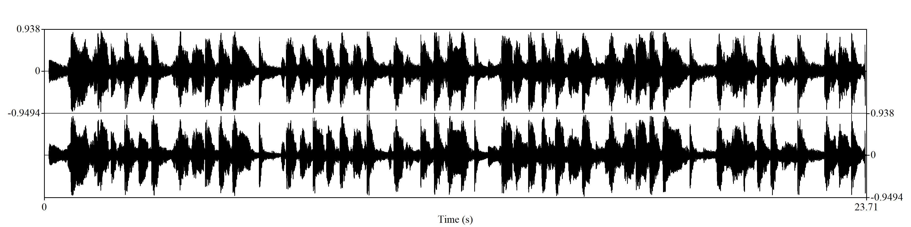

以下为基本音频信息：

```python
Time domain:
   Start time: 0 seconds
   End time: 23.70501133786848 seconds
   Total duration: 23.70501133786848 seconds
Time sampling:
   Number of frames: 2367 (1913 voiced)
   Time step: 0.01 seconds
   First frame centred at: 0.02250566893423944 seconds
Ceiling at: 600 Hz

Estimated quantiles:
   10% = 78.1306671 Hz = 73.0564644 Mel = -4.27246994 semitones above 100 Hz = 2.41863363 ERB
   16% = 86.5869194 Hz = 80.4114788 Mel = -2.493348 semitones above 100 Hz = 2.65176313 ERB
   50% = 155.824991 Hz = 137.196972 Mel = 7.67911952 semitones above 100 Hz = 4.38859546 ERB
   84% = 387.40436 Hz = 293.258052 Mel = 23.4460823 semitones above 100 Hz = 8.70743003 ERB
   90% = 398.439585 Hz = 299.694897 Mel = 23.9323318 semitones above 100 Hz = 8.87411693 ERB
Estimated spreading:
   84%-median = 231.6 Hz = 156.1 Mel = 15.77 semitones = 4.32 ERB
   median-16% = 69.26 Hz = 56.8 Mel = 10.18 semitones = 1.737 ERB
   90%-10% = 320.4 Hz = 226.7 Mel = 28.21 semitones = 6.457 ERB

Minimum 75.2435031 Hz = 70.5225954 Mel = -4.92433291 semitones above 100 Hz = 2.33784802 ERB
Maximum 574.720561 Hz = 393.454388 Mel = 30.274328 semitones above 100 Hz = 11.2200723 ERB
Range 499.5 Hz = 322.931793 Mel = 35.2 semitones = 8.882 ERB
Average: 219.801173 Hz = 177.526356 Mel = 10.4544718 semitones above 100 Hz = 5.458551 ERB
Standard deviation: 128.3 Hz = 89.46 Mel = 10.7 semitones = 2.532 ERB

Mean absolute slope: 945.5 Hz/s = 671 Mel/s = 85.64 semitones/s = 19.17 ERB/s
Mean absolute slope without octave jumps: 26.29 semitones/s
```

结合波形图及数据，我们可以对这一音频进行简单的分析，并提取出这首BGM的一些基本特性：

- 这段波形图中有着界限分明的峰与谷，说明混响较少，且音调远低于歌声。整体上看，音频呈现一种较为明显的规律性变化，排布为以一段为一组的多段相似片段，这也与曲中实际的歌词、节拍相对应。
- 分析数据来看，这首BGM的标准差很大（89.46 Mel），且平均音调较高（177.53 Mel），这说明BGM的高低音频率差距大，且高音较高。这与曲子的听觉感受也是一致的。

此外，结合内容创作的情况，可以得到结论：

- 民谣性质的BGM，常用于贴近生活的题材。曲调较为舒缓，有节奏感，整体稳定没有突变，便于营造情境与带入。

##### 我和你

以下为波形图：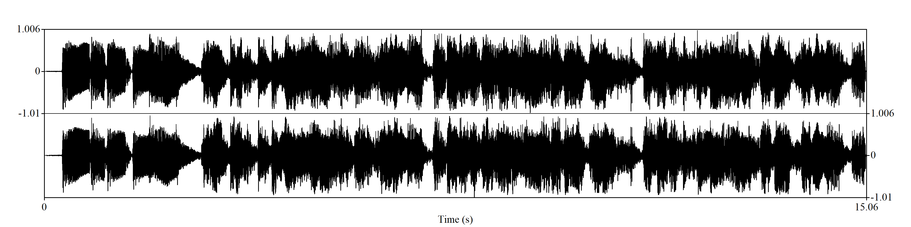

以下为基本音频信息：

```python
Time domain:
   Start time: 0 seconds
   End time: 15.058480725623582 seconds
   Total duration: 15.058480725623582 seconds
Time sampling:
   Number of frames: 1502 (1307 voiced)
   Time step: 0.01 seconds
   First frame centred at: 0.02424036281179209 seconds
Ceiling at: 600 Hz

Estimated quantiles:
   10% = 78.3575936 Hz = 73.2551285 Mel = -4.22226002 semitones above 100 Hz = 2.42495722 ERB
   16% = 98.3160097 Hz = 90.4529827 Mel = -0.29402078 semitones above 100 Hz = 2.96684697 ERB
   50% = 114.749947 Hz = 104.220969 Mel = 2.38192178 semitones above 100 Hz = 3.3930853 ERB
   84% = 223.385105 Hz = 187.472363 Mel = 13.9143959 semitones above 100 Hz = 5.84458847 ERB
   90% = 301.414861 Hz = 240.339677 Mel = 19.1010066 semitones above 100 Hz = 7.30599442 ERB
Estimated spreading:
   84%-median = 108.7 Hz = 83.28 Mel = 11.54 semitones = 2.452 ERB
   median-16% = 16.44 Hz = 13.77 Mel = 2.677 semitones = 0.4264 ERB
   90%-10% = 223.1 Hz = 167.1 Mel = 23.33 semitones = 4.883 ERB

Minimum 75.8076949 Hz = 71.0186669 Mel = -4.79500558 semitones above 100 Hz = 2.35368313 ERB
Maximum 452.309996 Hz = 330.079383 Mel = 26.1277425 semitones above 100 Hz = 9.65069149 ERB
Range 376.5 Hz = 259.060716 Mel = 30.92 semitones = 7.297 ERB
Average: 153.527827 Hz = 131.845094 Mel = 5.45644875 semitones above 100 Hz = 4.17770968 ERB
Standard deviation: 84.9 Hz = 60.83 Mel = 7.728 semitones = 1.743 ERB

Mean absolute slope: 484.7 Hz/s = 361.5 Mel/s = 50.92 semitones/s = 10.56 ERB/s
Mean absolute slope without octave jumps: 26.27 semitones/s
```

结合波形图及数据，我们可以对这一音频进行简单的分析，并提取出这首BGM的一些基本特性：

- 波形图中有着明显的规律性，约为 4 s 一个周期。
- 整体数值较为平稳（相比于其他BGM）

此外，结合内容创作的情况，可以得到结论：

- 曲风明快，有较强节奏感，适合温馨题材的作品。整首BGM没有中断感，一般搭配的视频都是一镜到底。

##### 一起长大的幸福

以下为波形图：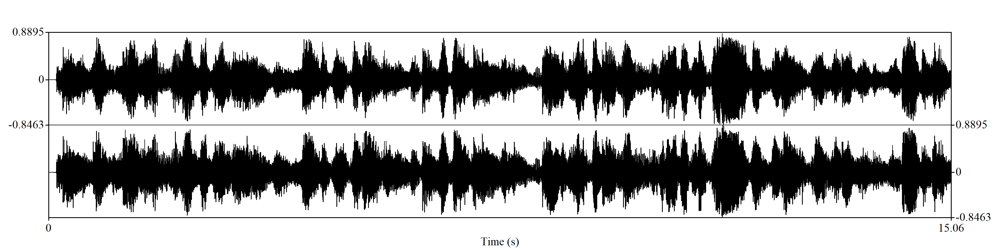

以下为基本音频信息：

```python
Time domain:
   Start time: 0 seconds
   End time: 15.058480725623582 seconds
   Total duration: 15.058480725623582 seconds
Time sampling:
   Number of frames: 1502 (918 voiced)
   Time step: 0.01 seconds
   First frame centred at: 0.02424036281179209 seconds
Ceiling at: 600 Hz

Estimated quantiles:
   10% = 79.6054469 Hz = 74.3462886 Mel = -3.94873135 semitones above 100 Hz = 2.45966291 ERB
   16% = 92.662134 Hz = 85.6354705 Mel = -1.31937824 semitones above 100 Hz = 2.81613593 ERB
   50% = 122.123533 Hz = 110.28813 Mel = 3.46009472 semitones above 100 Hz = 3.57887174 ERB
   84% = 427.704771 Hz = 316.409212 Mel = 25.1593836 semitones above 100 Hz = 9.30336054 ERB
   90% = 439.655197 Hz = 323.091075 Mel = 25.6364703 semitones above 100 Hz = 9.47354502 ERB
Estimated spreading:
   84%-median = 305.7 Hz = 206.2 Mel = 21.71 semitones = 5.728 ERB
   median-16% = 29.48 Hz = 24.67 Mel = 4.782 semitones = 0.7632 ERB
   90%-10% = 360.2 Hz = 248.9 Mel = 29.6 semitones = 7.018 ERB

Minimum 74.9570157 Hz = 70.2705268 Mel = -4.99037496 semitones above 100 Hz = 2.32979813 ERB
Maximum 501.980534 Hz = 356.681386 Mel = 27.931577 semitones above 100 Hz = 10.3173836 ERB
Range 427 Hz = 286.410859 Mel = 32.92 semitones = 7.988 ERB
Average: 200.02888 Hz = 161.704974 Mel = 8.16677722 semitones above 100 Hz = 4.98622648 ERB
Standard deviation: 141.1 Hz = 96.77 Mel = 11.11 semitones = 2.717 ERB

Mean absolute slope: 763.6 Hz/s = 535.5 Mel/s = 67.47 semitones/s = 15.23 ERB/s
Mean absolute slope without octave jumps: 22.75 semitones/s
```

结合波形图及数据，我们可以对这一音频进行简单的分析，并提取出这首BGM的一些基本特性：

- 波形图中出现了一定的规律性，约 3 s 一个小周期，对应原BGM的节奏与歌词。
- 从数据中看，这首BGM高音部分较多（206.2 Mel），但最高音却又不算特别高（356.7 Mel），与歌曲中的童声相符。
- 此外，歌曲的标准差非常大（96.77 Mel），推测是因为背景音乐音调较低，同时歌手吐字分明导致的。数据中，平均绝对斜率的值非常大（535.5 Mel ，接近《dance monkey》），但无倍频程跳跃的平均绝对斜率则比较正常

此外，结合内容创作的情况，可以得到结论：

- BGM节奏为活泼平稳，常用于亲子、成长的题材。BGM整体连贯性较高，作品也多为一镜到底。


#### 3.1.4 横向比对

下图为数据分析中的样本的数据所作：


从数据图可以直观看到，在 **Mean absolute slope** 中，各BGM出现了较为明显的差异，而在 **Minimum** 中各BGM的差别较小。

据此可以判断，大多数BGM中的低音部分是相近的，都加入了作为背景音的混响，以增加音乐感染力及信息丰富度。

**Mean absolute slope** 意味**平均绝对斜率**，它的定义是：分析音频中一段时间里音高曲线的音高标准差，音高曲线上空点的地方，程序会按线性插值的方法补足,然后计算。而平均绝对斜率的差异，更多地体现在曲风上，高音、女生一般会有更高的数值。

从 Average 、Standard deviation 两个指标看，各BGM基本没有太大差异，这也从侧面说明了各BGM风格具有一定的相似性和稳定性。此外，对于数值相近的BGM，通过对题材情况及听觉感受的判断，发现其很可能属于相近的风格类型。例如，《dancing with your ghost》是唯一一首抒情而略带伤感的BGM，整体风格清新，而在数值上也与其他BGM区别明显。而《桥边姑娘》《旧梦一场》则都属于女声演唱、节奏稳定的BGM，只是背景混响存在差别，从图中可以看到，它们的数值较为相近。有趣的是这两首BGM也常常用于照片展示、小姐姐题材的作品，但具体风格中会有一些差异。

作一个总结：

大多BGM会有较为稳定的底音部分，许多BGM的最高音部分会有近 400 Mel。BGM的标准差较为稳定，大多处于 100 Mel 以内，这或许有利于营造氛围、带入情境，帮助观看者全神贯注地了解视觉内容及视频含义。数值相近的BGM，听觉感受、对应题材可能也会相近。


#### 3.1.5 猜想检验

##### 3.1.4.1 BGM的旋律具有稳定性

**猜想解释：**

这里的稳定性指BGM中的旋律具有某种重复性，即没有非常频繁的转折变化。

进一步讲，在短暂的BGM中，一般会持续为相近的音调节奏，或某些特殊的BGM中间会出现一次变调，起到转折的作用。从合理性的角度去分析，在用户观看短视频进行消遣时，不宜输出过于复杂庞大的信息量，这会给增加用户的疲劳程度，同时节奏多变也难以营造出一中固定氛围，来与视觉内容搭配。

**猜想论证：**

从随机所选的十首BGM中，通过波形图及解析得到的数据可以看到，有80%的数据支持，BGM的数据是保持稳定或具有某种规律的。剩余20%的数据均为英文歌，且其中一首虽然波形图呈现了一定的不稳定，但真实听觉中整体节奏较为平缓。

这样就得到两个论据：

1. 在样本中，有80%~90%的数据支持我们的结论。
2. 样本选取虽然有一定的人为因素，但更加注重实际数据，即选取的都是具有代表性的高频使用的BGM，样本的可靠具有保障。

由此可以说，从当前样本的结果而言，结论“BGM的旋律具有稳定性”有超过80%的概率是正确的.


##### 3.1.4.2 BGM偏向于快节奏，一般对应整首歌中的高光部分

**猜想解释：**

由于短视频多为15 s ~ 30 s，为了更好的内容效果，对于大多数内容而言，选择快节奏的短视频是理论上的较优选择。

整首歌的高光部分指：经过前面的铺垫，而出现的高音或核心部分，一般有着较强的氛围营造感与感染力。

**猜想论证：**

在所选的十个样本中，只有《桥边姑娘》的波形图显示连续性较弱，但其节奏仍可以达到4/4拍，仅用约20 s 的时间就完成了两个八拍的内容。采用**极大值搜索法***来估计，只需通过波形图就可以了解到：所有样本BGM均为快节奏。由于对音频数据流操控能力有限，暂未能写出通过极大值搜索法进行检验的程序。

这样，在测试集中，支持的数据为100%。

对于后半句猜想，我们寻找了BGM的原曲，通过人工检验的方式确定了其正确性。此外，也用了数据分析的方式，对《dance monkey》进行了检验，将原曲截为每段 15 s，通过绘制波形图并分析的方法证明了结论。如果读者有兴趣，可以用代码再对其他BGM进行分析验证。

在测试集中，对于猜想“BGM偏向于快节奏，一般对应整首歌中的高光部分”有着强支持（100%)。这说明该结论在多数情况下是正确的。但这一结论并非绝对正确，我们也发现有少量的反例，那一类BGM对应的是特定题材，画面本身很有沉浸感，BGM只是作为辅助。

**极大值搜索法：选取自相关序列在某一区域内的极大值出现时间间隔作为该音乐节拍的长度*


##### 3.1.4.3 BGM会对原曲进行一些改变, 可能加入特殊的音效

**猜想解释：**

BGM往往是改编后的结果，与原曲相比，常常会增加音效来满足使用需求。

**猜想论证：**

从所选的测试集分析，多首BGM在原曲的基础上增加了混响音效，旧梦一场、小星星、桥边姑娘、我和你、谪仙都是再创作后的作品。相比原曲，抖音BGM往往更喜欢经DJ混响改变后的版本（普遍数据而言）。

支持数据占到了测试集的50%，说明这一猜想存在合理性，但只有一部分的正确性。

更精细地去分析，会发现不同类型的BGM对混响的需求不同，例如《桥边姑娘》是一首民谣，混响声音偏小。而作为流行音乐的《旧梦一场》《小星星》等BGM，混响音效的声音更大。更进一步地，它们适用的短视频作品类型也有所不同。


##### 3.1.4.4 对应不同题材的短视频，会有特定的BGM适用

**猜想解释：**

BGM是基于题材决定的，而不论是由于思维惯性，还是恰到好处的节奏匹配，合适的BGM都可以帮助提升视频内容。

从当前各平台的数据来看，不同风格的BGM会有明显不同的MCN使用倾向以及内容题材的区别。

**猜想论证：**

从 3.14 横向比对部分，以及对BGM数值与风格的猜想进行了讨论，结果表明，BGM-音频数值-作品题材之间是有着相关性的。但由于样本数量限制，暂时无法得出是强相关还是弱相关。


### 3.2 短视频类型和特定热门BGM的关系分析

#### 3.2.1 关于 单一BGM更多的用于什么类型的短视频 的分析

​	要想研究单一BGM往往用于什么类型的短视频，我们就需要先收集一定量的BGM及对应短视频的数据。

​	首先，我们选取了十首热门的BGM作为我们本次分析的主体BGM。

​	然后，我们选择采用**随机抽样**的方式在各BGM对应的热门短视频列表中随机抽取短视频，并根据视频的内容和所要表达的含义为其打上至少一个至多5个的**Tag**，来作为各短视频的主题和类型。

​	在收集到一定量的BGM及对应短视频的数据并为其打上tag之后，我们在jupyter中利用python的matplotlib库来对抽样得到的各BGM的短视频tag进行了统计和展示，以此来初步反映研究的BGM的各类短视频tag占比及占比的份额，即简单反映了单一的BGM更适用于哪几种类型的短视频。

​	为了使统计得到的饼状图较为直观和美观，我们将只出现了一次的tag归类到了其他，便于我们观察。（例如下图所示）


#### 3.2.2 关于 某类型的短视频更适合使用哪个BGM 的分析

​	光是知道2.1得到的单一BGM往往用于什么类型的短视频的数据分析结果，实际的使用价值并不大。我们继而考虑到，如果能将2.1分析得到的单一BGM更多的用于什么类型的短视频的数据信息转化并分析得到 某类型的短视频更适合使用哪个BGM，就能有更大的更为实际的商业使用价值。（例如2.3讲的一种应用方式）

​	但是，2.1的数据分析结果是并不能直接推出 某类型的短视频更适合使用哪个BGM,其根本原因就在于，即便我们抽样的短视频集合都是对应BGM下的热门短视频的集合，抽到的短视频之间必然还是会有热度上的差异，这样简单的tag数量的占比只是反映了视频制作者对于这些tag类型的视频更倾向于使用什么BGM，没有考虑到实际对应视频本身的热度，即没有考虑各BGM使用在这些占比较高的tag的短视频下是否是真正能得到更多的**受众的青睐**的。

​	制作者多数人都爱用的并不是完全代表了受众多数人都觉得这个BGM用于此tag下效果最好最合适的。

​	因此通俗的来说，在2.1我们研究的是多数制作人都爱用的，而在2.2我们就要开始研究多数受众都爱看的。


##### 3.2.2.1 关于 单一的BGM**更适合**用于哪些tag类型的短视频 的分析

​	为了得到 某类型的短视频更适合使用哪个BGM 的分析结果，首先我们选择去研究单一的BGM**更适合**用于哪些tag类型的视频。

​	注意这里的“更适合”，和前面的“更多用于”是两个概念！

​	到了这里有人可能会说，要考虑视频本身的热度，点赞数不就是反映视频本身热度的吗，直接加权到对应视频的tag下不就好了吗？

​	其实不然，我们并不能简单的将点赞数等加权到各视频对应的tag下，因为**点赞数往往更多的是反映受众对于这个视频整体的喜爱程度，而视频的主体部分是由 内容和BGM 这两大要素构成**，单纯的将点赞数加权到对应视频的tag下并不能真实反映**BGM对该短视频产生的作用**。

​	因此，我们需要寻找一个更合适的参数来反映BGM在各视频中所产生的作用系数。

​	在这时，我们发现，评论数和转发数更多的是反映受众对于视频内容的喜爱程度。当一个短视频是更注重于通过内容本身去吸引人，就会有相对来说更多的人会进行评论和转发，比如在点赞数量相当的几个短视频中，一个核心内容是科普的短视频，它的转发量就相对较高；一个核心内容是追星的短视频，他的评论量就相对较高......由此可见，短视频越是依靠内容取胜，即BGM起的作用越小，此时的 **点赞数 /（评论数+转发数）**就会越低，反之亦然。

​	所以，在这里我们选择通过 **点赞数 /（评论数+转发数）**的方式，来模拟除掉内容的吸引力之外 视频对人们的吸引力，即以此参数来大致描绘BGM在各视频中所产生的作用系数。

​	在算出每一个短视频的BGM作用系数时，有一需要注意的地方，就是会出现一些不太合理的比例参数数据（在这里我们以100为界，将参数大于100的数据都视为不太合理的数据），初步怀疑可能是通过买赞等手段异常化了数据，这样的垃圾数据需要将其做删除处理。

​	我们将上述得到的作用系数加权到对应的视频的tag上，来得到更为精确的各BGM下 的对应Tag类型的短视频的受欢迎程度占比。再次使用matplotlib库将占比以饼状图的形式展示，同时以列表的方式展现了部分占比排序列表，可以清晰的反映出各BGM适合的视频类型的排序及占比。（例如下图所示）


##### 3.2.2.2 关于 某类型的短视频更适合使用哪个BGM 的分析

​	在2.2.1中我们得到了关于 各单一BGM更适合用于哪些tag类型的短视频 的分析结果，获得了各BGM下的对应Tag类型的短视频的受欢迎程度占比，借助这个数据成果，我们将继续分析某类型的短视频更适合使用哪个BGM。

​	研究某类型的短视频更适合使用哪个BGM，换个角度想就是要获取各BGM在该tag类型短视频下的推荐度，然后将各BGM按照推荐度进行降序排列并取前五个，就可以得到该tag类型的短视频的更适合使用的BGM列表。

​	而要获得各BGM在某个tag类型短视频下的推荐度，我们认为可以通过将2.2.1中获得的 各BGM下的各Tag类型的短视频的受欢迎程度占比 * 对应BGM的使用次数，来代表各BGM在各tag类型短视频下的推荐度。

​	**在拥有足够的多的BGM和对应视频数据的情况下，**就可以真正实现某类型的短视频更适合使用哪个BGM的最优推荐。


## 4. 案例分析

### 4.1 BGM案例分析

*关于这一组的详细数据及图像，可以在代码部分的 /data/BGM_info/ 目录下查看*

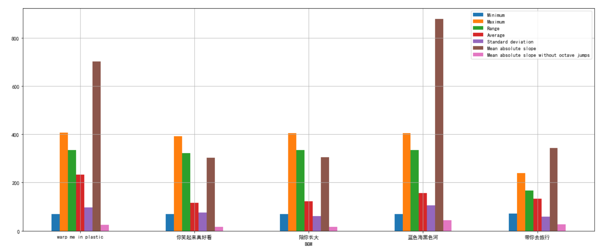

通过对照组BGM的数值比对可以看出，除了 Mean absolute slope 的差异，其他数值都较为稳定。而风格相似的三首歌《你笑起来真好看》《陪你长大》《带你去旅行》则有着极为相似的数值，《warp me in plastic》与《蓝色海黑色河》的风格则更为相近，在数值上也呈现出极高的相似性。这里的情况也可以印证之前 3.1.3.4 中的结论的可靠性。

对于BGM稳定性、音效分析，可以对照这五首BGM的波形图，此处不再赘述。

此外，这五首BGM也都是快节奏，且对应着原曲中的高潮部分。


### 4.2 应用：对用户输入的视频关键词进行BGM推荐

我们尝试简单的将2.2得到的数据分析结果进行一个实际应用，同时我也相信本数据还有其他可商业化的应用方法等待继续的挖掘，这里是一个抛砖引玉的简单应用。

​	首先，通过使用经验，我们发现在抖音发布视频时，大多时候我们会很难自行找到与自己视频很契合的 BGM 配乐。抖音配乐种类繁多，数目庞大，找到与视频内容相符，同时又能吸引眼球，获取关注度的 BGM 配乐绝非易事。其次，在统计数据的过程中，我们也逐渐发现，不少视频存在着内容与音乐完全脱节的情况，使得配乐非但没有成为锦上添花的工具，反而成为视频的短板，影响视频整体的观看体验。**当然，不排除有些音乐本身节奏，韵律的优势，使得即便在内容与配乐脱节的情况下，仍能使视频取得较高的热度与关注度。针对此种情况，我们将专门采取音乐本身的节奏与种类等特征的分析，获取那些热门音乐的自身优势，为用户提供更容易爆款的视频配乐的同时，也为抖音本身提供更多爆款音乐的特征分析，为配乐商业化，音乐人合作等商业化用途提供可能。**而本应用主要针对视频与配乐的匹配度与热度提升这一综合层面，展开应用的分析。

​	在以上讨论的前提以及问题的基础上，我们首先分析这一应用的需求性与针对上述问题的解决力。

​	第一，我们推荐的**前提条件**是用户的视频与BGM的匹配。针对这一需求，我们首先通过数据的统计与分析，标记每个视频的高频出现的tag标记，然后采取**tag匹配**的方式，检索所有包含用户标注的tag的BGM。最大程度上保证了BGM符合用户发布的视频内容，规避配乐与内容脱离的现象，节省用户挑选配乐的时间与出错率。在基础上提高效率与质量。

​	第二，我们在基础之上采取的推荐机制是利用**视频热度，音乐热度，内容热度这三和维度的综合指标**进行配乐的推荐排序，为用户进行配乐的推荐。在视频热度这一维度，我们采取点赞量这一种指标进行分析；在音乐热度这一维度上，我们采取音乐使用数量这一指标进行分析；在内容热度这一维度，我们采取评论量与转发量这一指标进行分析。在最大程度 **规避视频内容与发布者本身的影响**因素下，综合配乐在视频中起到的作用与视频的热度这两个因素具体衡量在特定tag下配乐对视频的帮助度。更精准，更高效地进行配乐的推荐。同时可以防止因视频内容与作者本身的影响，使得分析更具可信度，让推荐更具有普遍意义与推广意义。

​	第三，针对应用的长期发展层面考虑。在使用该推荐应用后，**发布的视频数据也成为被收集与统计的数据，对进一步的推荐进行反馈。由于该数据分析的灵活性与即时性，使得反馈的结果可以对应用较快地进行维护与改善，达到应用于使用两者间的良性循环。使得应用在后期发展中的灵活性，敏捷性，与可维护性**都得到足够的保证。

​	第四，针对该应用的拓展性发展思考。我们初步预想该应用可以与多项活动联合，相互利用促进。比如，我们在研究过程发现，部分“网红”会对热门的BGM进行类似于“挑战”性质的视频录制。因此，**我们不妨可以让应用与类似于“BGM挑战赛”等活动联合，鼓励用户积极针对BGM进行视频的创作，将这部分视频纳入数据统计分析的范畴。不仅可以更好地为推荐应用获取优质，可靠的数据来源，进行分析。还可以在用户选择BGM的时候，进行更好的灵感激发，更好地让该应用为用户服务。除此之外，我们还可以针对视频数据，反向作用于BGM创作**，为其提供信息，鼓励创作者为那些热门的视频内容与视频种类创作优质的BGM资源与爆款音频，实现音乐与视频的双赢。


## 5. 想对老师说的话

首先，通过这次项目，我们所有组员都有了明显的收获。

更重要的是，我们所有成员都对此次作业有着极高的兴趣度与参与度。老师本次作业的巧妙安排，让我们极大程度上的实现了所学与所接触的连通性，在自己的日常生活中，探索专业的可能，让我们意识到可以凭借自己的努力，创造日常生活中的价值。也希望我们在以后的学习过程中，也能不断这样创造与探索，在正式走向岗位的那一天，实现生活更多的可能！


## 6. 附录

### 6.1 部分代码说明

*以下部分内容主要为对pyAudioAnalysis的介绍*

##### ShortTermFeatures.py

- 短期时长的特征抽取：`feature_extraction()`方法

  将音频信号拆分成短期的片段/元组，然后计算每个片段/元组的特征，最终生成整段音频的特征向量的序列。

  通过这个方法可以提取出音频的多中数值特征

##### MidTermFeatures.py

- 中期时长的特征抽取：`mid_feature_extraction()`方法

  根据整段音频的短期片段的特征向量的序列，计算了一些统计值，如均值、标准差等。

##### audioTrainTest.py

- `classifier_wrapper()`:分类未知的样本
- `random_split_features()`:将实验样本随机拆分成训练集和测试集，用于交叉验证
- `train_knn()`, `train_svm()`, `train_SVM_RBF()`, `train_extra_trees()`, `train_random_forest()` and `train_gradient_boosting()`: 基于不同算法的训练模型
- `normalize_features()`: 将数据集进行标准化，进行0平均和归一化处理
- `load_model()`: 从文件中加载分类模型

##### audioAnalyse.py

- `dirMp3toWavWrapper(directory, samplerate, channels)`: 把mp3 转成wav
- `featureExtractionFileWrapper(wav_file, out_file, mt_win, mt_step,st_win, st_step)`:从WAV文件中提取特征
- `fileSpectrogramWrapper(wav_file)`：从WAV文件中提取频谱图
- `featureExtractionDirWrapper(directory, mt_win, mt_step, st_win, st_step)`：提取文件夹中存储的所有WAV文件的特征

##### audioBasicIO.py

- `read_audio_file(input_file)`: 读取文件，转化为信号
- `stereo_to_mono(signal)`: 信号转为单声道信号


